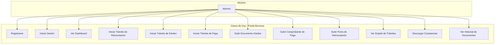
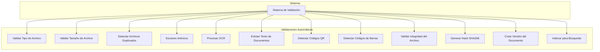
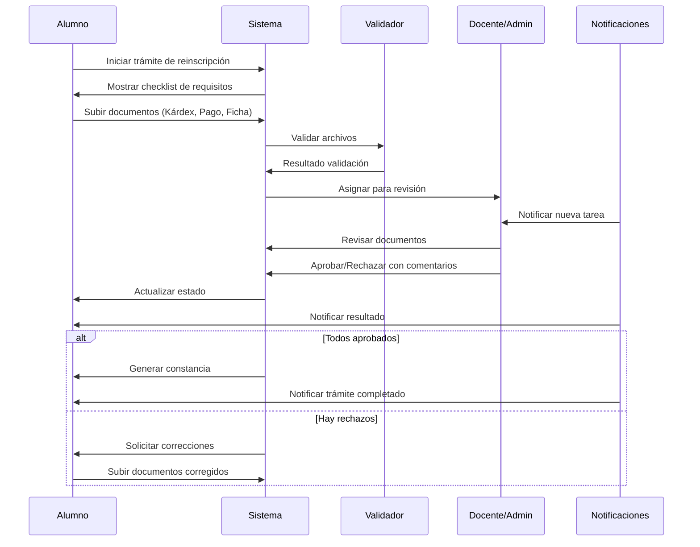

# Diagramas de Casos de Uso - Sistema de Gestión de Documentos Universitarios

## 1. Diagrama General de Actores y Casos de Uso

```mermaid
graph TB
    subgraph "Actores Externos"
        A[Alumno]
        D[Docente]
        AD[Administrativo]
        ADM[Administrador del Sistema]
    end
    
    subgraph "Sistema de Gestión de Documentos"
        subgraph "Portal de Alumnos"
            UC1[Registrarse en el Sistema]
            UC2[Iniciar Sesión]
            UC3[Ver Dashboard Personal]
            UC4[Iniciar Trámite]
            UC5[Subir Documentos]
            UC6[Ver Estado de Trámites]
            UC7[Recibir Notificaciones]
        end
        
        subgraph "Portal de Docentes/Administrativos"
            UC8[Iniciar Sesión]
            UC9[Ver Cola de Revisión]
            UC10[Revisar Documentos]
            UC11[Aprobar/Rechazar Documentos]
            UC12[Comentar en Documentos]
            UC13[Reasignar Trámites]
        end
        
        subgraph "Administración del Sistema"
            UC14[Gestionar Usuarios]
            UC15[Configurar Tipos de Trámite]
            UC16[Configurar Requisitos]
            UC17[Gestionar Roles y Permisos]
            UC18[Ver Reportes]
            UC19[Configurar Flujos de Trabajo]
        end
        
        subgraph "Sistema de Validación"
            UC20[Validar Archivos]
            UC21[Escaneo Antivirus]
            UC22[Procesar OCR]
            UC23[Detectar Códigos QR/Barras]
        end
    end
    
    A --> UC1
    A --> UC2
    A --> UC3
    A --> UC4
    A --> UC5
    A --> UC6
    A --> UC7
    
    D --> UC8
    D --> UC9
    D --> UC10
    D --> UC11
    D --> UC12
    D --> UC13
    
    AD --> UC8
    AD --> UC9
    AD --> UC10
    AD --> UC11
    AD --> UC12
    AD --> UC13
    
    ADM --> UC14
    ADM --> UC15
    ADM --> UC16
    ADM --> UC17
    ADM --> UC18
    ADM --> UC19
    
    UC5 --> UC20
    UC5 --> UC21
    UC5 --> UC22
    UC5 --> UC23
```

## 2. Casos de Uso Detallados - Portal de Alumnos

## 3. Casos de Uso Detallados - Portal de Docentes/Administrativos

```mermaid
graph TB
    subgraph "Personal Académico"
        D[Docente]
        AD[Administrativo]
    end
    
    subgraph "Casos de Uso - Revisión"
        UC1[Iniciar Sesión]
        UC2[Ver Cola de Trabajo]
        UC3[Filtrar por Tipo de Trámite]
        UC4[Filtrar por Prioridad]
        UC5[Revisar Documento]
        UC6[Aprobar Documento]
        UC7[Rechazar Documento]
        UC8[Agregar Comentarios]
        UC9[Solicitar Cambios]
        UC10[Reasignar a Otro Revisor]
        UC11[Ver Historial de Revisiones]
        UC12[Generar Reporte de Actividad]
    end
    
    D --> UC1
    D --> UC2
    D --> UC3
    D --> UC4
    D --> UC5
    D --> UC6
    D --> UC7
    D --> UC8
    D --> UC9
    D --> UC10
    D --> UC11
    D --> UC12
    
    AD --> UC1
    AD --> UC2
    AD --> UC3
    AD --> UC4
    AD --> UC5
    AD --> UC6
    AD --> UC7
    AD --> UC8
    AD --> UC9
    AD --> UC10
    AD --> UC11
    AD --> UC12
```

## 4. Casos de Uso del Sistema - Validaciones Automáticas

## 5. Casos de Uso de Administración

```mermaid
graph TB
    subgraph "Administrador"
        ADM[Administrador del Sistema]
    end
    
    subgraph "Gestión del Sistema"
        UC1[Gestionar Usuarios]
        UC2[Crear/Editar Roles]
        UC3[Asignar Permisos]
        UC4[Configurar Tipos de Trámite]
        UC5[Definir Requisitos por Programa]
        UC6[Configurar Flujos de Trabajo]
        UC7[Gestionar Departamentos]
        UC8[Gestionar Programas Académicos]
        UC9[Configurar SLA por Trámite]
        UC10[Ver Reportes de Cumplimiento]
        UC11[Auditar Actividad del Sistema]
        UC12[Gestionar Políticas de Retención]
        UC13[Configurar Notificaciones]
        UC14[Gestionar Integraciones Externas]
    end
    
    ADM --> UC1
    ADM --> UC2
    ADM --> UC3
    ADM --> UC4
    ADM --> UC5
    ADM --> UC6
    ADM --> UC7
    ADM --> UC8
    ADM --> UC9
    ADM --> UC10
    ADM --> UC11
    ADM --> UC12
    ADM --> UC13
    ADM --> UC14
```

## 6. Flujo Principal - Trámite de Reinscripción

## 7. Casos de Uso de Búsqueda y Reportes

```mermaid
graph TB
    subgraph "Usuarios Autorizados"
        U[Usuario Autorizado]
    end
    
    subgraph "Búsqueda y Consultas"
        UC1[Buscar por Matrícula]
        UC2[Buscar por Nombre de Alumno]
        UC3[Buscar por Tipo de Documento]
        UC4[Buscar por Estado de Trámite]
        UC5[Buscar por Fechas]
        UC6[Buscar por Texto en OCR]
        UC7[Filtrar por Programa Académico]
        UC8[Filtrar por Departamento]
    end
    
    subgraph "Reportes"
        UC9[Reporte de SLA por Trámite]
        UC10[Reporte de Cuellos de Botella]
        UC11[Reporte de Cumplimiento]
        UC12[Reporte de Volumetría]
        UC13[Reporte de Actividad por Usuario]
        UC14[Reporte de Documentos Pendientes]
    end
    
    U --> UC1
    U --> UC2
    U --> UC3
    U --> UC4
    U --> UC5
    U --> UC6
    U --> UC7
    U --> UC8
    U --> UC9
    U --> UC10
    U --> UC11
    U --> UC12
    U --> UC13
    U --> UC14
```

## Descripción de Actores

### Actores Principales
- **Alumno**: Usuario que inicia trámites y sube documentos
- **Docente**: Personal académico que revisa y aprueba documentos
- **Administrativo**: Personal administrativo que gestiona trámites
- **Administrador del Sistema**: Configura y mantiene el sistema

### Actores Secundarios
- **Sistema de Validación**: Procesa automáticamente los archivos
- **Sistema de Notificaciones**: Envía alertas y actualizaciones
- **Sistema de Reportes**: Genera estadísticas y análisis

## Relaciones entre Casos de Uso

### Inclusión (Include)
- Todos los casos de uso incluyen "Iniciar Sesión"
- "Subir Documentos" incluye "Validar Archivos"
- "Revisar Documentos" incluye "Ver Historial de Revisiones"

### Extensión (Extend)
- "Notificar Resultado" extiende "Aprobar/Rechazar Documentos"
- "Solicitar Cambios" extiende "Rechazar Documento"
- "Generar Constancia" extiende "Completar Trámite"

### Generalización
- "Iniciar Trámite" es generalización de "Iniciar Trámite de Reinscripción", "Iniciar Trámite de Kárdex", etc.
- "Revisar Documentos" es generalización de "Aprobar Documento" y "Rechazar Documento"
